



<header>

# {{ title }}

<nav>
  <h2 class="heading">Навигация по странице</h2>
  <ol>
    <li><a href="#header-1">Начало работы.</a></li>
    <li><a href="#header-2">Настройки.</a></li>
    <li><a href="#header-3">Шаблоны (Templates).</a></li>
    <li><a href="#header-4">Макеты (Layouts).</a></li>
    <li><a href="#header-5">Метаданные (Front Matter).</a></li>
    <li><a href="#header-6">Файлы данных шаблонов (Template Data Files).</a></li>
    <li><a href="#header-7">Файлы данных каталога (Directory Data Files).</a></li>
    <li><a href="#header-8">Глобальные файлы данных (Global Data Files).</a></li>
    <li><a href="#header-9">Коллекции (Collections).</a></li>
    <li><a href="#header-10">Пагинация (Pagination).</a></li>
    <li><a href="#header-11">Каскад данных (Data Cascade).</a></li>
    <li><a href="#header-12">Фильтры (Filters).</a></li>
    <li><a href="#header-13">Плагины (Plugins).</a></li>
  </ol>
</nav>
</header>

<span class="cursive"><small class="bold">Дата последней правки: </small><time datetime="2025-06-16"><small>16 июня 2025</small></time></span>

<span class="cursive"><small class="bold">Примечание:</small> <small>в примерах используется синтаксис шаблонизатора <a href="nunjucks.html">Nunjucks</a>.</small></span>

<section>

## <span id="header-1">Начало работы</span>

Eleventy предназначен для создания статических веб-сайтов, которые не требуют бэкенда, базы данных или серверного рендеринга. Сайт представляет собой набор готовых файлов, которые можно напрямую разместить на веб-хостинге. Eleventy также используется для создания сложных сайтов с помощью плагинов и API.

Поэтапная установка и запуск Eleventy:

1. Скачайте и установите <a href="https://nodejs.org/en/download" target="_blank" rel="noopener noreferrer"><cite>Node.js</cite></a> (требуется Node.js версии 18 или выше) и npm.
2. Проверьте работоспособность:
+ показать версию Node.js:

```shell
node --version
```

+ показать версию npm:

```shell
npm --version
```

    При необходимости также можно обновить менеджер пакетов npm до последней версии глобально:

```shell
npm install -g npm@latest
```

3. Создайте папку для будущего проекта (например, <span class="blue">eleventy-project</span>):

```shell
mkdir eleventy-project
```

4. Перейдите в эту папку:

```shell
cd eleventy-project
```

    Далее все команды в терминале следует вводить из этой папки.

5. Создайте и настройте файл <span class="blue">package.json</span>:

```shell
npm init -y
```

6. Установите Eleventy локально в проект:

```shell
npm install --save-dev @11ty/eleventy
```

    Это добавляет запись devDependencies в файл <span class="blue">package.json</span> и устанавливает пакет Eleventy в папку <span class="blue">node_modules</span> в проекте. Локальная установка означает, что Eleventy будет работать только для файлов внутри этого каталога. После установки в папке проекта появятся папка <span class="blue">node_modules</span> и файл <span class="blue">package-lock.json</span>. Файл <span class="blue">package-lock.json</span> обеспечивает воспроизводимость сборки: любой компьютер с <cite>Node.js</cite> и npm сможет установить Eleventy в папку <span class="blue"> node_modules</span> в той же версии, что и у вас. 
    
    Обновить Eleventy до последней версии:
    
```shell
npm install --save-dev @11ty/eleventy@latest
```

7. Создайте конфигурационный файл <span class="blue">.eleventy.js</span> в корне проекта. В этом 
файле настраивается Eleventy.

8. Создайте пустой файл <span class="blue">.nojekyll</span> в корне проекта. Это необходимо только при размещении сайта на GitHub Pages, чтобы предотвратить обработку сайта как проекта Jekyll (по умолчанию GitHub Pages использует Jekyll для генерации сайтов).

9. Запустите локальный сервер разработки:

```shell
npx @11ty/eleventy --serve
```

    Сервер запустится по адресу: <span class="blue">http://localhost:8080/</span>. Локальный сервер останавливается комбинацией клавиш <kbd> Ctrl+C</kbd>.

По умолчанию Eleventy использует структуру ваших файлов и папок для создания статического сайта.

<figure>

```
eleventy-project/
├── package.json                   # Информация о проекте и зависимости проекта
├── node_modules                   # Папка со служебными зависимостями
├── .gitignore                     # Файл с исключениями для системы контроля версий
├── .eleventy.js                   # Основной файл конфигурации Eleventy
├── index.md                       # Главная страница сайта
├── src/                           # Исходные файлы
│   ├── _drafts/                   # Черновики статей
│   ├── _data/                     # Глобальные данные для всего сайта
│   │   └── brands.json            # Файл с данными
│   ├── includes/                  # Шаблоны, которые используются в других страницах
│   │   ├── base.njk               # Базовый HTML-шаблон (head, body, и т. д.)
│   │   ├── post.njk               # Шаблон для отдельных постов в блоге
│   │   └── footer.njk             # Футер страницы
│   ├── scripts/                   # Подключаемые скрипты
│   ├── assets/                    # Исходные ресурсы сайта
│   │   ├── css/                   # Таблица стилей
│   │   ├── img/                   # Изображения
│   │   └── fonts/                 # Шрифты
│   ├── blog/                      # Папка для постов в блоге
│   │   ├── blog.json              # Файл данных для блога
│   │   ├── post-1.md              # Первый пост
│   │   ├── post-2.md              # Второй пост
│   │   └── post-3.md              # Третий пост
└── site/                          # Скомпилированный сайт (папка вывода)
```

<figcaption>Структура проекта в Eleventy</figcaption>
</figure>

<figure>
    
<figcaption>Структура проекта в Eleventy</figcaption>
</figure>

Файл <span class="blue">.eleventy.js</span> используется для настройки различных аспектов сайта, таких как указание входных и выходных директорий, добавление поддержки разных шаблонизаторов, определение фильтров и шорткодов для обработки данных, а также подключение плагинов для расширения функциональности Eleventy.

Файл <span class="blue">package.json</span> необходим для управления зависимостями проекта, определения скриптов для запуска (например, для сборки или запуска сервера разработки) и отслеживания версий установленных пакетов. Этот файл позволяет воспроизвести среду разработки на любом компьютере.

Любые пути, перечисленные в файле <span class="blue">.gitignore</span>, исключаются из отслеживания системой контроля версий.

Папка <span class="blue">node_modules</span> хранит установленные через npm/yarn пакеты и их зависимости. Eleventy автоматически игнорирует эту папку.

✒️ <dfn>Зависимость в программировании</dfn> — это внешний компонент или библиотека, которую ваш проект использует для выполнения определённых задач.

Основные команды Eleventy:

+ `npx @11ty/eleventy --serve` — запускает Eleventy в режиме разработки с автоматической перезагрузкой сайта при любых изменениях в файлах. Команда используется для локальной разработки и тестирования. Сайт можно посмотреть, если перейти по адресу, который указан в консоли после запуска команды.
+ `npm run build` — команда генерирует статический сайт и сохраняет его в папке <span class="blue">_site</span>
  (или в другой папке, указанной в настройках Eleventy). Полученную папку можно развернуть на любом веб-сервере.

Команды переопределяются в файле <span class="blue">package.json</span>:

```json
{
  "scripts": {
    "start": "eleventy --serve",
    // Запуск сервера разработки
    "build": "cross-env ELEVENTY_ENV=production eleventy"
    // Сборка проекта для релиза (production)
  }
}
```

Теперь в терминале команда `npm start` заменяет команду `npx @11ty/eleventy --serve`.

<figure>
    
<figcaption>Сборка сайта в Eleventy</figcaption>
</figure>

</section>

---

<section>

## <span id="header-2">Настройки</span>

Все настройки проекта хранятся в файле <span class="blue">.eleventy.js</span> (также допускается имя файла — <span class="blue">eleventy.config.js</span>):

<figure>

```js
module.exports = function (eleventyConfig) {
    // Настройка копирования файлов без обработки
    eleventyConfig.addPassthroughCopy('assets');
    eleventyConfig.addPassthroughCopy('**/*.jpg');

    // Фильтр для форматирования дат на русском языке
    eleventyConfig.addFilter("date", function (dateObj) {
        return dateObj.toLocaleDateString('ru-RU', {
            year: 'numeric',
            month: 'long',
            day: 'numeric'
        });
    });

    return {
        dir: {
            input: "src",          // Папка с исходными файлами
            output: "site",        // Папка для сгенерированного сайта
            includes: "includes",  // Папка с шаблонами
            data: "_data"          // Папка с глобальными данными
        },
        templateFormats: [
            "md",     // Markdown
            "njk",    // Nunjucks
            "html"    // HTML
        ],
        markdownTemplateEngine: 'njk',   // Шаблонизатор для Markdown-файлов
        pathPrefix: '/conspect'          // Префикс для всех URL
    };
};
```

<figcaption>Файл <span class="blue">.eleventy.js</span></figcaption>
</figure>

`module.exports = function (eleventyConfig)` — функция, которая принимает объект `eleventyConfig`, используемый для настройки Eleventy.

`eleventyConfig.addPassthroughCopy('assets')` — указывает Eleventy копировать все файлы из директории <span class="blue">src/assets</span> в выходную директорию без обработки. Файлы скопируются без преобразования или обработки шаблонов. Это полезно для изображений, видео, CSS, JavaScript и шрифтов, так как Eleventy по умолчанию не обрабатывает эти файлы и без функции `addPassthroughCopy` (сквозное копирование) будет их игнорировать.

Пути для копирования файлов `passthroughCopy` относительны к корню проекта, а не входному каталогу. При использовании настройки `input: "src"` и `output: "site"` в файле <span class="blue">.eleventy.js</span>, команда `eleventyConfig.addPassthroughCopy('assets')` скопирует содержимое папки <span class="blue">src/assets</span> в папку <span class="blue">site/assets</span>.

`eleventyConfig.addPassthroughCopy('**/*.jpg')` — копирует все JPG-файлы в проекте в выходную папку, сохраняя структуру каталогов.

`templateFormats: ["md", "njk", "html"]` — определяет, какие расширения файлов Eleventy будет обрабатывать как шаблоны.

`markdownTemplateEngine: 'njk'` — устанавливает Nunjucks как движок для Markdown-файлов. Все файлы Markdown будут сначала обработаны Nunjucks, а затем преобразованы в HTML.

`dir: { ... }` — определяет структуру каталогов проекта.

+ `input: 'src'` — указывает, что исходные файлы находятся в папке <span class="blue">src</span>;
+ `output: 'site'` — результат сборки сайта будет сохраняться в папку <span class="blue">site</span>;
+ `includes: 'includes'` — указывает папку для переиспользуемых компонентов (частей страниц) внутри входной директории (<span class="blue">src</span>). В этом случае компоненты должны находиться в папке <span class="blue">src/includes</span>;
+ `data: '_data'` — указывает папку для глобальных данных внутри входной директории (<span class="blue">src</span>). Глобальные данные должны находиться в папке <span class="blue">src/_data</span>.

`pathPrefix: '/conspect'` — определяет базовый URL для сайта. Если сайт размещается в подкаталоге <span class="blue">/conspect</span> домена <span class="blue">example.com</span>, то `pathPrefix` должен быть установлен в <span class="blue">/conspect</span>. В этом случае все ссылки на сайте будут начинаться с <span class="blue">/conspect</span> (например, <span class="blue">/conspect/eleventy</span>).

Eleventy обрабатывает файлы с расширениями, указанными в `templateFormats`, находящиеся в папке <span class="blue">src</span>, и выводит полученный контент в папку <span class="blue">site</span>.

При изменении конфигурационного файла необходимо перезапустить сервер разработки, чтобы изменения вступили в силу.

</section>

---

<section>

## <span id="header-3">Шаблоны (Templates)</span>

✒️ <dfn>Шаблон</dfn> — это файл контента, который Eleventy преобразует в страницу или страницы на созданном сайте.

Создавая шаблон, мы избавляемся от необходимости вручную копировать и вставлять код каждый раз при создании новой страницы. Шаблоны позволяют комбинировать контент и данные для создания любого HTML-кода, необходимого для сайта. В Eleventy разрешается смешивать разные языки шаблонов в одном файле, например, Markdown и Nunjucks.

*По умолчанию* Eleventy ищет шаблоны и макеты в папке <span class="blue">_includes</span>, которая расположена внутри входной директории (<span class="blue">src</span>). Файлы, расположенные в папке <span class="blue">src/_includes</span>, не генерируют отдельные страницы, а используются как части других страниц: шаблоны, макеты, включаемые элементы.

Для начала создадим базовые шаблоны для проекта:

1. Создайте папку <span class="blue">includes</span> (см. конфиг <a href="#header-2">.eleventy.js</a>) в папке <span class="blue">src</span>.
2. Внутри папки <span class="blue">includes</span> создайте файл <span class="blue">base.njk</span> (шаблон макета), который будет содержать основной HTML-каркас для каждой страницы:

<figure>

```html 
<!DOCTYPE html>
<html lang="ru">
<head>
    <meta charset="UTF-8">
    <meta content="width=device-width, initial-scale=1.0" name="viewport">
    <meta content="{{ description }}" name="description">  <!-- Описание страницы (если задано) -->
    <meta content="frontrabotka.github" name="author">
    <title>{{ title | default('Игрушечные модели автомобилей') }}</title>
    <link href="assets/style/main.css" rel="stylesheet">
</head>
<body>
    <main>
        
        {{ content | safe }}  <!-- Содержимое страницы, вставляемое сюда -->
        
    </main>
      <!-- Подключаем футер -->
</body>
</html>

```

<figcaption>Файл шаблона <span class="blue">base.njk</span> (<span class="blue">src/includes/base.njk</span>)</figcaption>
</figure>

` {{ description }} ` — получает значение из Front Matter файла дочерней страницы (например, из <span class="blue">src/index.md</span>). Данные могут также поступать из других источников в каскаде данных. Eleventy автоматически подставляет это описание во время сборки (см. раздел «<a href="#header-5">Метаданные</a>»).

Данные в Front Matter переопределяют значения по умолчанию, заданные в шаблоне. Если в Front Matter эти данные отсутствуют, используются значения, заданные в базовом шаблоне или других источниках каскада данных (см. раздел «<a href="#header-11">Каскад данных</a>»).

` <title>{{ title | default('Игрушечные модели автомобилей') }}</title> ` — задаёт заголовок страницы. Фильтр `| default` в Eleventy используется для установки значения по умолчанию, когда основное значение отсутствует. Если переменная `title` не определена, используется значение по умолчанию — `Игрушечные модели автомобилей`.

`  ` — подключает частичный шаблон (partial) <span class="blue">footer.njk</span>. Частичные шаблоны — это небольшие, переиспользуемые фрагменты HTML, такие как «подвал», «шапка» или навигация. Использование `include` позволяет избежать дублирования кода на каждой странице и упрощает внесение изменений (достаточно изменить файл шаблона, и изменения отразятся везде). *По умолчанию* Eleventy ищет частичные файлы в папке <span class="blue">_includes</span>.

` ... ` — определяет блок контента. Блоки используются для наследования шаблонов: дочерние шаблоны могут переопределять содержимое блоков, определённых в родительском шаблоне.

+ `  ` — начало блока.
+ `  ` — конец блока.

` {{ content | safe }} ` — во время сборки Eleventy автоматически вставляет сюда содержимое из Markdown-файлов и других источников данных. Фильтр `| safe` отключает автоматическое экранирование HTML, позволяя выводить HTML-контент без изменений.

Создадим шаблон «подвала» сайта в папке <span class="blue">src/includes/</span> — <span class="blue">footer.njk</span>:

<figure>

```html
<p>© 2025</p>
```

<figcaption>Шаблон «подвала» сайта: <span class="blue">footer.njk</span> (<span class="blue">src/includes/footer.njk)</span></figcaption>
</figure>

</section>

---

<section>

## <span id="header-4">Макеты (Layouts)</span>

✒️ <dfn>Макет</dfn> — это шаблон, определяющий общую структуру страницы, в которую «оборачивается» содержимое других шаблонов.

Макеты придают нескольким шаблонам одинаковую базовую структуру.

Согласно настройкам в <a href="#header-2">.eleventy.js</a>, Eleventy ищет макеты в папке <span class="blue">src/includes/</span>.

Создадим дополнительные страницы сайта:

1. Создайте в папке <span class="blue">src/</span> файл <span class="blue">index.md</span>. Это будет главная страница сайта:

<figure>

```html  
---
layout: base.njk  <!-- Указываем макет base.njk -->
title: Игрушечные модели автомобилей  <!-- Этот заголовок будет отображён в теге <title> (см. base.njk) -->
description: Коллекционные модели автомобилей разных стран
---

# {{ title }}

<p>Добро пожаловать на сайт коллекционных моделей автомобилей!</p>
<a href="blog/post-1/">Перейти к первому посту </a>

```

<figcaption>Файл главной страницы: <span class="blue">index.md</span> (<span class="blue">src/index.md</span>)</figcaption>
</figure>

2. Запустите сервер локально из директории, содержащей файл <span class="blue">.eleventy.js</span>, с помощью команды `npm start`. Чтобы остановить сервер, нажмите <kbd>Ctrl+C</kbd>.
3. Создайте в папке <span class="blue">src/includes/</span> макет <span class="blue">post.njk</span>, который будет использоваться для создания постов в блоге, и добавьте в него следующее:

<figure>

```liquid 
  <!-- Наследуем базовый шаблон base.njk -->


<article>
    <h1>{{ title }}</h1>
    <p>Автор: {{ author }}</p>
    <time>Дата публикации: {{ date | date('YYYY-MM-DD') }}</time>  <!-- date берется из front matter, и, если date нет - страница не создастся. -->
    <h2>Список автомобилей:</h2>
    <ul>
        
            <li>{{ brand }}</li>
        
    </ul>
    {{ content | safe }}
</article>


```

<figcaption>Макет <span class="blue">post.njk</span> (<span class="blue">src/includes/post.njk</span>)</figcaption>
</figure>

`  ` — команда указывает на наследование от родительского шаблона <span class="blue">base.njk</span>. Текущий шаблон становится дочерним и перенимает структуру <span class="blue">base.njk</span>. При этом можно переопределять отдельные блоки, сохраняя общую структуру. `extends` удобен для создания набора страниц с единым дизайном.

` {{ date | date('YYYY-MM-DD') }} ` — переменная, обычно получаемая из Front Matter, которая содержит дату создания файла. В этом примере используется кастомный фильтр `date()`, добавленный в конфигурации Eleventy (файл <a href="#header-2">.eleventy.js</a>), для форматирования даты в нужном виде. `YYYY-MM-DD` — это шаблон форматирования, где:

+ `YYYY` — год в формате 2025;
+ `MM` — месяц в формате 01-12;
+ `DD` — день в формате 01-31.

` <li>{{ brand }}</li> ` — пример итерации (цикла) по списку данных (массиву). Цикл перебирает каждый элемент списка `brands` (значения берутся из Front Matter дочерней страницы, например, файла <span class="blue">post-1.md</span>), присваивает его переменной `brand`, которая затем используется для формирования HTML.

✒️ <dfn>Черновики</dfn> в Eleventy позволяют создавать и редактировать контент, не публикуя его сразу на сайте. *По умолчанию*, Eleventy ищет черновики в папке <span class="blue">_drafts/</span>.

Существует два способа опубликовать черновик:

+ Переместить файл из директории <span class="blue">_drafts/</span> в «публичную» директорию (например, <span class="blue">src/</span> или другую).
+ Использовать флаг `published: false` в Frontmatter и изменить его на `true`:

```markdown
---
published: true
---
```

`published: false` — флаг в Front Matter указывает Eleventy не включать страницу в финальную сборку сайта. Файл будет проигнорирован.

</section>

---

<section>

## <span id="header-5">Метаданные (Front Matter)</span>

✒️ <dfn>Метаданные</dfn> в Eleventy — это блок в начале файла, который содержит информацию о странице. Блок ограничен тремя дефисами (`---`) в начале и в конце и позволяет добавлять метаинформацию. Front Matter может быть в форматах YAML, JSON или JavaScript.

Данные в Front Matter имеют наивысший приоритет и переопределяют другие данные (например, значения по умолчанию в шаблонах), за исключением вычисляемых данных.

Создадим страницу первого поста:

1. Для этого создайте папку <span class="blue">blog</span> внутри папки <span class="blue">src/</span>.
2. Создайте файл <span class="blue">post-1.md</span> внутри <span class="blue">src/blog/</span>:

<figure>

```html
---
layout: post.njk
title: Легковые автомобили СССР
description: Коллекция легковых автомобилей СССР
author: frontrabotka
tags:
- posts
- ussr
- passenger
date: 2025-05-01
permalink: blog/post-1/
brands:
- Volga
- Moskvich
- Lada
---
<!-- Здесь будет текст статьи -->
```

<figcaption>Пост в блоге: файл <span class="blue">post-1.md</span> (<span class="blue">src/blog/post-1.md</span>)</figcaption>
</figure>

`layout: post.njk` — указывает Eleventy использовать файл <span class="blue">post.njk</span> как макет.

`tags: posts`, `ussr` и `passenger` — указывает Eleventy, в какие коллекции включить данную страницу. Теги автоматически создают соответствующие коллекции (см. раздел «<a href="#header-9">Коллекции</a>»).

`date: 2025-05-01` — переопределяет дату по умолчанию, для сортировки.

`permalink: /blog/post-1/` — задаёт URL-адрес страницы. Если подкаталог <span class="blue">blog</span> не существует, он будет создан автоматически. **Важно**: если не указать имя файла и завершающий слэш (`/`), Eleventy создаст файл без расширения.

При `permalink: false` запись файла в выходную папку отключается. Файл обрабатывается, но не доступен в выходном каталоге. Это может быть полезно, например, для sitemap.

`brands: Volga`, `Moskvich` и `Lada` — это пользовательское поле данных, специфичное для этого поста. Если массив `brands` также определён в других местах, значения из Front Matter будут иметь приоритет. Данные для массива `brands` также возможно вынести в отдельный глобальный файл (<span class="blue">brands.json</span>) (см. раздел «<a href="#header-8">Глобальные файлы данных</a>»).

</section>

---

<section>

## <span id="header-6">Файлы данных шаблонов (Template Data Files)</span>

✒️ <dfn>Файлы данных шаблонов</dfn> в Eleventy — это отдельные файлы с данными, которые предназначены для использования в конкретном шаблоне. Они помогают отделить метаданные и конфигурацию от контента, делая структуру проекта более организованной.

Вместо написания ключей во Front Matter можно создать отдельный файл данных шаблона, предоставляющий данные для отдельного шаблона. Например, для файла <span class="blue">post-1.md</span> в папке <span class="blue">blog/</span> можно создать файл <span class="blue">post-1.json</span>. Eleventy также поддерживает альтернативные имена: <span class="blue">post-1.11tydata.json</span> или <span class="blue">post-1.11tydata.js</span>.

<figure>

```json
{
  "layout": "post.njk",
  "title": "Легковые автомобили СССР",
  "description": "Коллекция легковых автомобилей СССР",
  "tags": [
    "posts",
    "ussr",
    "passenger"
  ],
  "author": "frontrabotka",
  "permalink": "blog/post-1/",
  "brands": [
    "Volga",
    "Moskvich",
    "Lada"
  ]
}
```

<figcaption>Файл <span class="blue">post-1.json</span> (<span class="blue">src/blog/post-1.json</span>)</figcaption>
</figure>

Данные из файла автоматически доступны в шаблоне через переменные.

После создания файла данных шаблона, одинаковые поля следует удалить из Front Matter файла <span class="blue">post-1.md</span>:

<figure>

```markdown
---
date: 2025-05-01
---

<!-- Здесь будет текст статьи -->
```

<figcaption>Пост в блоге: файл <span class="blue">post-1.md</span> (<span class="blue">src/blog/post-1.md</span>)</figcaption>
</figure>

В файле <span class="blue">post-1.md</span> остались только `title`, `description`, `date`, `permalink` и `brands`, так как остальные параметры (`layout`, `tags`, `author`) теперь определены в файле данных каталога <span class="blue">blog.json</span>.

Данные из файла данных шаблона автоматически объединятся с данными из Front Matter, при этом данные из Front Matter будут иметь приоритет.

<small class="cursive"><span class="bold">Примечание I</span>: в файле <span class="blue">post-1.md</span> я оставил ключ date, так как Eleventy выдавал ошибку при сборке, если date находился в файле <span class="blue">
post-1.json</span>.</small>

<small class="cursive"><span class="bold">Примечание II</span>: в случае проблемы с отображением страницы <span class="blue">post-1.md</span> после запуска локального сервера, попробуйте:</small>

<small class="cursive">1. Удалить содержимое папки <span class="blue">blog/</span> в выходной папке <span class="blue">site/</span>;</small>

<small class="cursive">2. Перезапустить сервер.</small>

</section>

---

<section>

## <span id="header-7">Файлы данных каталога (Directory Data Files)</span>

✒️ <dfn>Файлы данных каталога</dfn> в Eleventy задают данные, которые будут доступны всем шаблонам внутри определённой папки. Это упрощает централизованное управление метаданными для связанных файлов.

Файлы данных каталога позволяют создать общий файл с настройками, которые будут использоваться для всех шаблонов в данной папке (каталоге).

Создадим файл данных каталога для папки <span class="blue">blog/</span>:

1. Удалите файл <span class="blue">post-1.json</span> из папки <span class="blue">blog/</span>. Если <span class="blue">post-1.json</span> останется, его данные переопределят данные из <span class="blue">blog.json</span>.
2. Для папки <span class="blue">blog/</span> создайте файл данных <span class="blue">blog.json</span> (Eleventy также поддерживает имена <span class="blue">blog.11tydata.json</span> или <span class="blue">blog.11tydata.js</span>). Важно, чтобы имя JSON-файла совпадало с именем папки, в которой он находится. В этом файле зададим значения по умолчанию для макета и другие ключи, которые применятся ко всем файлам в папке <span class="blue">blog/</span>:

<figure>

```json
{
  "layout": "post.njk",
  "tags": ["posts"],
  "author": "frontrabotka"
}
```

<figcaption>Файл <span class="blue">blog.json</span> (<span class="blue">src/blog/blog.json</span>)</figcaption>
</figure>

    `"tags": ["posts"]` — добавляет каждый файл в этой папке в коллекцию posts. Если в подпапках нет своих файлов данных каталога, то эти теги будут применяться и к файлам в этих подпапках.
    
    Теперь эти данные (например, `author`, определённый в <span class="blue">blog.json</span>) доступны через переменные в любом шаблоне, расположенном в папке <span class="blue">blog/</span>. Для доступа к данным в шаблонах (например, в <span class="blue">post.njk</span>) используется синтаксис: ` {{ author }} `.

3. После создания файла данных каталога, измените файл <span class="blue">post-1.md</span>:

<figure>

```html
---
title: Легковые автомобили СССР
description: Коллекция легковых автомобилей СССР
date: 2025-05-01
permalink: blog/post-1/
brands:
- Volga
- Moskvich
- Lada
---
<!-- Здесь будет текст статьи -->
```

<figcaption>Пост в блоге: файл <span class="blue">post-1.md</span> (<span class="blue">src/blog/post-1.md</span>)</figcaption>
</figure>

<small class="cursive"><span class="bold">Примечание</span>: в случае проблемы с отображением страницы <span class="blue">post-1.md</span> после запуска локального сервера, попробуйте:</small>

<small class="cursive">1. Удалить содержимое папки <span class="blue">blog/</span> в выходной папке <span class="blue">site/</span>;</small>

<small class="cursive">2. Перезапустить сервер.</small>

</section>

---

<section>

## <span id="header-8">Глобальные файлы данных (Global Data Files)</span>

✒️ <dfn>Глобальные файлы данных</dfn> в Eleventy — это файлы, которые содержат данные, доступные для всех шаблонов проекта. Данные размещаются в директории <span class="blue">_data/</span> и могут быть в форматах JSON или JavaScript.

1. Создадим папку <span class="blue">_data</span> в папке <span class="blue">src/</span>. Eleventy автоматически добавляет все .json файлы и значения `module.exports` из .js файлов, которые находятся в этой папке, в глобальный объект данных, доступный во всех шаблонах.
2. В папке <span class="blue">src/_data</span> создадим файл <span class="blue">brands.json</span> с массивом строк, значения которого будет использовать страница первого поста — <span class="blue">post-1.md</span>:

<figure>

```json
[
  "Volga",
  "Moskvich",
  "Lada"
]
```

<figcaption>Файл <span class="blue">brands.json</span> (<span class="blue">src/_data/brands.json</span>)</figcaption>
</figure>

3. После создания файла <span class="blue">brands.json</span> удалите массив `brands` из Front Matter файла <span class="blue">post-1.md</span>, чтобы данные брались из <span class="blue">brands.json</span>:

<figure>

```html
---
title: Легковые автомобили СССР
description: Коллекция легковых автомобилей СССР
date: 2025-05-01
permalink: blog/post-1/
---
<!-- Здесь будет текст статьи -->
```

<figcaption>Пост в блоге: файл <span class="blue">post-1.md</span> (<span class="blue">src/blog/post-1.md</span>)</figcaption>
</figure>

Теперь, чтобы получить доступ к данным из <span class="blue">brands.json</span> в шаблоне <span class="blue">post.njk</span>, используйте имя файла (без расширения) как имя переменной: ` {{ brands }}`.

</section>

---

<section>

## <span id="header-9">Коллекции (Collections)</span>

✒️ <dfn>Коллекции</dfn> в Eleventy — это упорядоченные группы контента (например, страниц или постов), которые позволяют удобно работать с наборами связанных материалов на сайте. Коллекции автоматически упорядочиваются по дате создания и доступны во всех шаблонах проекта.

Коллекции позволяют объединять страницы со схожей тематикой или типом контента. Например, все записи блога можно объединить в коллекцию posts.

В Eleventy коллекции создаются двумя основными способами:

+ Через Front Matter: добавьте поле `tags` в Front Matter файла. Значение `tags` может быть строкой или массивом строк, указывающих, к каким коллекциям принадлежит данный контент. Теги (`tags`) в Eleventy используются только для создания коллекций.
+ Через файл конфигурации <span class="blue">.eleventy.js</span>:

```js
module.exports = function (eleventyConfig) {
    eleventyConfig.addCollection("posts", function (collectionApi) {
        return collectionApi.getFilteredByGlob("src/blog/*.md")
    })
}
```

Глоб-паттерн `src/blog/*.md` указывает Eleventy на необходимость включить в коллекцию posts все Markdown-файлы, которые находятся в папке <span class="blue">src/blog/</span>.

✒️ <dfn>Глоб-паттерн (glob pattern)</dfn> — это специальный шаблон для поиска файлов и директорий в системе.

Часть контента может быть частью нескольких коллекций, если указать несколько тегов в массиве `tags` в Front Matter. Выведем на главной странице список всех постов с тегом `posts`. Для этого в файле <span class="blue">index.md</span> добавим массив с объектом `collections`:

<figure>

```liquid  
---
layout: base.njk
title: Игрушечные модели автомобилей
description: Коллекционные модели автомобилей разных стран
---

# {{ title }}

<h2>Последние записи в блоге:</h2>


    <article>
        <a href="{{ post.url | url }}">
            <h2>{{ post.data.title }}</h2>
        </a>
        <time>{{ post.data.date | date('YYYY-MM-DD') }}</time>
    </article>


```

<figcaption>Файл главной страницы: <span class="blue">index.md</span> (<span class="blue">src/index.md</span>)</figcaption>
</figure>

`collections.posts` — это массив, который содержит все страницы, которым присвоен тег posts. 

Nunjucks отображает все символы, не входящие в выражения и операторы, буквально, включая пробелы. Символы `-%` (минус и процент) указывают Nunjucks, что нужно удалить пробелы в начале и конце блока.

Для работы с элементами коллекции в шаблонах доступны следующие свойства:

+ `post.url` — URL страницы;
+ `post.data` — данные из Front Matter;
+ `post.content` — содержимое страницы.

По умолчанию Eleventy сортирует контент в коллекциях по возрастанию даты (от старых к новым), используя следующие критерии:

1. Значение поля `date` в Front Matter (если указано).
2. Если поле `date` не указано, используется дата создания файла.
3. При совпадении дат файлы сортируются по полному пути к входному файлу (включая имя файла).

Для изменения порядка сортировки по убыванию в шаблоне можно использовать фильтр `| reverse`:

```liquid  

    <article>
        <a href="{{ post.url | url }}">
            <h2>{{ post.data.title }}</h2>
        </a>
        <time>{{ post.data.date | date('YYYY-MM-DD') }}</time>
    </article>


```

Фильтр `| reverse` инвертирует текущий порядок сортировки элементов коллекции, но не меняет критерий сортировки (например, по дате, по заголовку и т.д.).

Способ сортировки контента в коллекции можно изменить, изменив значение ключа `date` во Front Matter:

```markdown
---
date: 2025-05-01
---
```

Eleventy автоматически включает весь контент (независимо от наличия тегов) в коллекцию collections.all. Эта коллекция позволяет перебрать все страницы сайта в шаблоне:

```liquid  

    <article>
        <a href="{{ post.url | url }}">
            <h2>{{ post.data.title }}</h2>
        </a>
        <time>{{ post.data.date }}</time>
    </article>


```

</section>

---

<section>

## <span id="header-10">Пагинация (Pagination)</span>

✒️ <dfn>Пагинация</dfn> в Eleventy — это способ автоматического создания нескольких страниц контента из одного шаблона на основе предоставленных данных. Это полезно для разделения больших коллекций контента (например, постов блога) на отдельные страницы, улучшая навигацию, производительность сайта и SEO.

Пагинация может работать с данными в форме массива или массива объектов, а также с коллекциями Eleventy.

Чтобы настроить пагинацию:

1. Подготовьте данные для пагинации. В этом примере мы используем массив объектов с информацией об автомобилях, который расположен в файле <span class="blue">brands.json</span> (необходимо его изменить) в папке <span class="blue">_data/</span>:

<figure>

```json
[
  {
    "name": "Легковые автомобили СССР",
    "brands": [
      "Volga",
      "Moskvich",
      "Lada"
    ]
  },
  {
    "name": "Грузовые автомобили СССР",
    "brands": [
      "Gaz",
      "Kamaz",
      "Ural"
    ]
  },
  {
    "name": "Иностранные автомобили",
    "brands": [
      "Volvo",
      "Mercedes",
      "Opel"
    ]
  }
]
```

<figcaption>Файл <span class="blue">brands.json</span> (<span class="blue">src/_data/brands.json</span>)</figcaption>
</figure>

2. Создадим шаблон <span class="blue">cars.njk</span>, который будет использоваться для каждой страницы пагинации:

<figure>

```liquid  
---
layout: base.njk
pagination:
  data: brands
  size: 1
  alias: car
permalink: "brands/{{ car.name | slugify }}/"
---

<h1>{{ car.name }}</h1>

<ul>
    
        <li>{{ brand }}</li>
    
</ul>

<nav>
      <!-- Проверяем, есть ли предыдущая страница -->
        <a href="{{ pagination.previous | url }}">Предыдущая</a>  <!-- Если есть, показываем ссылку -->
    
      <!-- Проверяем, есть ли следующая страница -->
        <a href="{{ pagination.next | url }}">Следующая</a>  <!-- Если есть, показываем ссылку --> 
    
</nav>

```

<figcaption>Шаблон <span class="blue">cars.njk</span> (<span class="blue">src/cars.njk</span>)</figcaption>
</figure>

<small class="cursive"><span class="bold">Примечание:</span> После ключа pagination важно соблюдать отступы в строках для значений data, alias, size. Это связано с YAML-синтаксисом, который чувствителен к отступам. В противном случае Eleventy выдаст ошибку при сборке.</small>

**Важно**, чтобы файл <span class="blue">cars.njk</span> (или шаблон, указанный в настройках пагинации) находился в папке <span class="blue">src/</span>. Иначе папка <span class="blue">cars/</span> не сгенерируется.

Значение `pagination` во Frontmatter указывает Eleventy на необходимость создания нескольких страниц на основе данных, указанных в параметре `data`.

`data: brands` — указывает Eleventy, что нужно создать несколько страниц на основе данных из файла <span class="blue">brands.json</span> в папке <span class="blue">_data/</span>.

`size: 1` — определяет количество элементов на каждой странице. Значение `1` означает, что каждая запись из <span class="blue">brands.json</span> создаст отдельную страницу. Если бы было `2`, то страницы создавались бы по две записи на каждой.

`alias: car` — создаёт псевдоним для обращения к данным внутри шаблона. `alias: car` позволяет обращаться к данным каждой отдельной странице пагинации через переменную `car`. Это удобно, когда структура данных сложная и нужно избежать путаницы. Не рекомендуется использовать `alias: page`, так как `page` — это зарезервированное слово в Eleventy. Также зарезервированы `pagination` и `collections`.

` permalink: "brands/{{ car.name | slugify }}/" ` — определяет структуру URL для каждой создаваемой страницы. ` {{ car.name }} ` выводит значение свойства `name` текущего объекта (автомобиля), к которому мы обращаемся по псевдониму `car`. Фильтр `| slugify` преобразует название в URL-friendly формат (например, «Легковые автомобили» → «legkovye-avtomobili»). Тогда будет создан файл <span class="blue">index.html</span> внутри папки <span class="blue">legkovye-avtomobili</span>: <span class="blue">brands/legkovye-avtomobili/index.html</span>.

Навигацию между страницами можно реализовать с помощью переменных, которые Eleventy предоставляет для пагинации:

+ `pagination.previous` — ссылка на предыдущую страницу;
+ `pagination.next` — ссылка на следующую страницу;
+ `pagination.items` — массив ссылок на все страницы пагинации;
+ `pagination.pageNumber` — номер текущей страницы;
+ `pagination.pageSize` — размер страницы;
+ `pagination.totalPages` — общее количество страниц.

В результате сборки сайта создадутся 3 страницы в папке <span class="blue">brands/</span>, и каждая страница будет содержать контент, сгенерированный на основе одной записи из <span class="blue">brands.json</span>:

+ <span class="blue">gruzovye-avtomobili-ussr/index.html</span>
+ <span class="blue">inostrannye-avtomobili/index.html</span>
+ <span class="blue">legkovye-avtomobili-ussr/index.html</span>

Страницы сгенерированы, но пока не связаны с главной страницей. Чтобы добавить ссылки на эти страницы, измените файл <span class="blue">index.md</span>:

<figure>

```liquid  
---
layout: base.njk
title: Игрушечные модели автомобилей
description: Коллекционные модели автомобилей разных стран
---

# {{ title }}

<h2>Категории автомобильных моделей:</h2>

<ul>
    <li><a href="{{ 'brands/legkovye-avtomobili-ussr/' | url }}">Легковые автомобили СССР</a></li>
    <li><a href="{{ 'brands/gruzovye-avtomobili-ussr/' | url }}">Грузовые автомобили СССР</a></li>
    <li><a href="{{ 'brands/inostrannye-avtomobili/' | url }}">Иностранные автомобили</a></li>
</ul>

```

<figcaption>Файл главной страницы: <span class="blue">index.md</span> (<span class="blue">src/index.md</span>)</figcaption>
</figure>

Как альтернативу, можно использовать следующий ` permalink: "brands/page-{{ pagination.pageNumber }}/" `. Тогда каждая страница в папке <span class="blue">brands/</span> будет иметь свой URL в формате:

+ <span class="blue">page-0/index.html</span>
+ <span class="blue">page-1/index.html</span>
+ <span class="blue">page-2/index.html</span>

Тогда файл <span class="blue">index.md</span> должен выглядеть так:

<figure>

```liquid  
---
layout: base.njk
title: Игрушечные модели автомобилей
description: Коллекционные модели автомобилей разных стран
---

# {{ title }}

<h2>Категории автомобильных моделей:</h2>

<ul>
    <li><a href="{{ 'brands/page-0/' | url }}">Легковые автомобили СССР</a></li>
    <li><a href="{{ 'brands/page-1/' | url }}">Грузовые автомобили СССР</a></li>
    <li><a href="{{ 'brands/page-2/' | url }}">Иностранные автомобили</a></li>
</ul>

```

<figcaption>Файл главной страницы: <span class="blue">index.md</span> (<span class="blue">src/index.md</span>)</figcaption>
</figure>

Нумерация страниц начинается с <span class="blue">0</span>, так как `pagination.pageNumber` — это индекс текущей страницы в массиве данных.

Nunjucks позволяет изменить нумерацию страниц, начинающуюся с <span class="blue">0</span>, на нумерацию с <span class="blue">1</span>, добавив `+1`: ` permalink: "brands/page-{{ pagination.pageNumber + 1 }}/index.html" `.

Результирующие страницы с данными будут обновляться автоматически по мере добавления или редактирования записей в файле <span class="blue">brands.json</span>.

</section>

---

<section>

## <span id="header-11">Каскад данных (Data Cascade)</span>

✒️ <dfn>Каскад данных</dfn> в Eleventy — это система иерархической обработки данных, которая позволяет объединять информацию из разных источников в определённом порядке перед тем, как шаблон будет отрендерен. Чем ближе данные к контенту, тем выше их приоритет. Данные с более высокого уровня автоматически переопределяют данные с более низкого уровня.

Эта иерархия позволяет, например, задать общие настройки для всего сайта в глобальных файлах данных, переопределить их для конкретной папки в файлах данных каталога и затем переопределить отдельные параметры для конкретной страницы в Front Matter.

При объединении данных в каскаде данных в Eleventy порядок приоритета источников данных следующий (от наивысшего к низшему):

1. Вычисляемые данные (Computed Data) — специальные функции, которые могут динамически вычислять значения.
2. Метаданные (Front Matter) — данные из Front Matter текущего файла.
3. Файлы данных шаблонов (Template Data Files) — данные из файла с таким же именем, как у шаблона.
4. Файлы данных каталога (Directory Data Files) — данные из файла с таким же именем, как у папки.
5. Метаданные в макетах (Front Matter in Layouts) — данные из Front Matter макета.
6. Конфигурация API глобальных данных (Configuration API Global Data) — данные, добавленные через API.
7. Глобальные файлы данных (Global Data Files) — данные из папки <span class="blue">_data/</span>.

<figure>
    
    <figcaption>Каскад данных в Eleventy</figcaption>
</figure>

</section>

---

<section>

## <span id="header-12">Фильтры (Filters)</span>

✒️ <dfn>Фильтры</dfn> в Eleventy — это функции JavaScript, которые принимают значения в шаблоне, обрабатывают их, а затем возвращают изменённый контент для отображения вместо оригинала. Фильтры применяются к значениям с помощью оператора `|`.

Универсальный фильтр `url` работает с `pathPrefix` (который задаётся в файле <a href="#header-2">.eleventy.js</a>) для корректной нормализации абсолютных путей. Это полезно, если сайт размещён на GitHub Pages, который часто находится в подкаталоге. Если `pathPrefix` не установлен, то фильтр `url` ничего не делает. Например, при `pathPrefix: '/conspect'` можно использовать фильтр `url` следующим образом:

```liquid
<link rel="stylesheet" href="{{ '/css/style.css' | url }}">  <!-- В шаблоне -->
<link rel="stylesheet" href="/conspect/css/style.css">  <!-- В результате -->
```

Фильтр автоматически добавляет префикс ко всем путям в шаблонах, что важно при развёртывании сайта в подкаталоге.
Пример создания ссылки на главную страницу сайта (при условии, что в <span class="blue">.eleventy.js</span> установлен `pathPrefix`, иначе фильтр не будет работать):

```liquid
<a href="{{ '/' | url }}">Главная</a>  <!-- В шаблоне -->
<a href="/conspect/">Главная</a>  <!-- В результате -->
```

Фильтр `slugify` — инструмент для преобразования текста в формат URL-слагов. Он автоматически конвертирует любые строки в безопасные имена файлов или URL-пути. Например, после обработки следующего шаблона:

```liquid
---
title: Легковые автомобили СССР
permalink: "/{{ title | slugify }}/"
---
```

Результатом преобразования будет создание файла <span class="blue">index.html</span> в папке <span class="blue">legkovye-avtomobili-ussr/</span>: <span class="blue">/legkovye-avtomobili-ussr/index.html</span>.

Фильтр `slugify` выполняет следующие преобразования:

+ приведение всех букв к нижнему регистру;
+ замена пробелов на дефисы;
+ преобразование кириллицы в латиницу;
+ удаление специальных символов.

✒️ <dfn>URL-слаг (URL slug)</dfn> — это часть веб-адреса, которая следует после доменного имени или подкаталога и отделяется косой чертой (<span class="blue">/</span>).

</section>

---

<section>

## <span id="header-13">Плагины (Plugins)</span>

✒️ <dfn>Плагины</dfn> для Eleventy — это расширения, которые добавляют новую функциональность в систему. Они подключаются в конфигурационном файле <span class="blue">.eleventy.js</span> перед последним оператором `return` и должны быть установлены через npm.

Плагин eleventy-plugin-syntaxhighlight предназначен для автоматической подсветки синтаксиса кода в Markdown-файлах при сборке сайта.

Установка плагина <cite>@11ty/eleventy-plugin-syntaxhighlight</cite>:

1. Установите плагин:

```shell
npm install --save-dev @11ty/eleventy-plugin-syntaxhighlight
```

2. Зарегистрируйте плагин в файле <span class="blue">.eleventy.js</span>:

<figure>

```js
const syntaxHighlight = require("@11ty/eleventy-plugin-syntaxhighlight");

module.exports = function (eleventyConfig) {
    eleventyConfig.addPassthroughCopy('assets');
    eleventyConfig.addPassthroughCopy('**/*.jpg');

    eleventyConfig.addFilter("date", function (dateObj) {
        return dateObj.toLocaleDateString('ru-RU', {
            year: 'numeric',
            month: 'long',
            day: 'numeric'
        });
    });

    eleventyConfig.addPlugin(syntaxHighlight);  // Регистрация плагина подсветки синтаксиса

    return {
        dir: {
            input: "src",
            output: "site",
            includes: "includes",
            data: "_data"
        },
        templateFormats: [
            "md",
            "njk",
            "html",
        ],
        markdownTemplateEngine: 'njk',
        pathPrefix: '/conspect',
    };
};
```

<figcaption>Файл <span class="blue">.eleventy.js</span></figcaption>
</figure>

Для подсветки синтаксиса, код необходимо заключить в тройные обратные кавычки (<code>```</code>) с указанием языка программирования (например, javascript):

```js 
```js
const example = "Hello World";
console.log(example);
```


Если требуется подсветить и вывести код Nunjucks без обработки, используйте теги ` ... `. Например:

```liquid 

<body>
    <main>
        
            {{ content | safe }}
        
    </main>
    
</body>


```

</section>



<footer>
<section aria-labelledby="sources-title">
<h2 id="sources-title" class="message">Источники:</h2>
<ul class="source-list">







</ul>
</section>
</footer>

